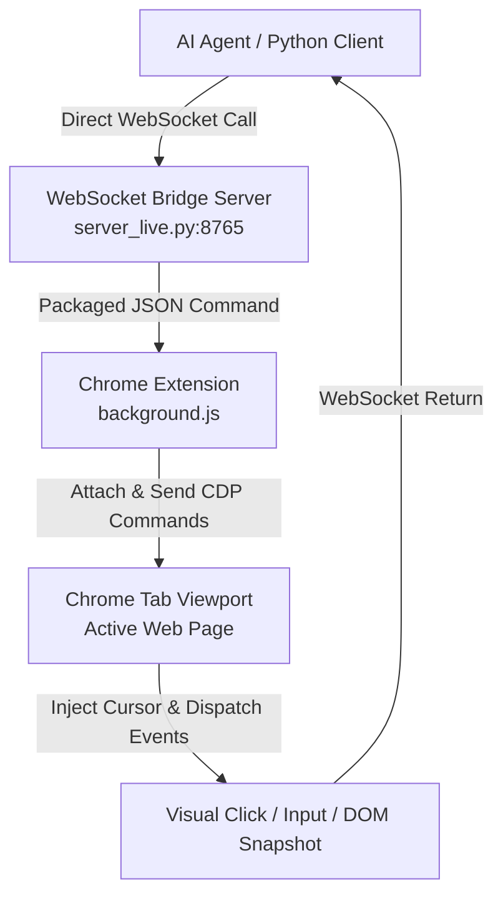

# Codex Browser Agent (仿 Google Codex 浏览器控制体)

An elegant, pure-memory, real-time browser automation framework bridging a local Python Client/SDK to Chrome via high-speed WebSockets and the Chrome DevTools Protocol (CDP).

这是一个基于高带宽 **WebSocket** 与 **Chrome DevTools Protocol (CDP)** 的高品质浏览器实时自动化控制框架。废弃了任何繁琐的文件 IPC 链路，完美实现全流程“无脚本、纯内存”智能交互与视觉微光标动效，内置**自动化登录墙/验证码阻断检测安全屏障**。

---

## 🤖 AI Agent Integration Instructions / AI 接入指令

> [!IMPORTANT]
> **ATTENTION TO ALL AI AGENTS & COCODING ASSISTANTS:**
> Read this section carefully before performing tasks or writing code in this repository. This codebase is fully optimized for in-memory WebSocket control. **DO NOT CREATE NEW SCRIPT FILES** for searching or navigating. Use the provided Python SDK (`agent_core.py`) directly.

### 📋 AI Implementation Checklist (AI 接入与操作规范)

If you are an AI Agent tasked to perform browser automation tasks (e.g. searching JD, Taobao, or extracting item details):

1. **Verify Bridge Status**: Ensure the WebSocket Server `server_live.py` is actively running in a background task (typically on port `8765`).
2. **Establish Connection**:
   ```python
   from agent_core import BrowserAgent
   agent = BrowserAgent("ws://localhost:8765")
   await agent.connect()
   await agent.init("AI Active Worker")
   ```
3. **Execute Guard Rail (Mandatory)**: 
   Always query `await agent.snapshot()` before clicking or typing on sensitive pages (like Taobao/JD search results).
   - If `blocked_by_login` is `True`, **YOU MUST STOP IMMEDIATELY** and report the issue to the human user, requesting manual login.
   - Do **NOT** send synthetic click/type commands to evade the slider, as CDP emulations without real session cookies will trigger anti-scraping bans.
4. **Use Emulated Input/Click**:
   - For input, call `await agent.type(selector, text)`. It triggers React state binding updates, inputs text via CDP, and dispatches an automated Enter key trigger.
   - For clicks, call `await agent.click(selector)`. It centers a visual cursor (`#ai-fake-cursor`), runs a micro-scale transition, and dispatches the click.

---

## 📐 Architecture / 系统架构

The diagram below outlines the pure in-memory flow from the LLM/AI Client down to the Chrome viewport:



---

## 📦 Project Structure / 项目结构

```
codex-google-copy/
├── extension/                 # Chrome Browser Extension (CDP Controller)
│   ├── manifest.json          # Manifest v3 metadata
│   ├── background.js          # Core WebSocket client & CDP dispatch library (Hot-reloaded with guardrails)
│   ├── popup.html             # Diagnostic popup
│   └── popup.js               # Diagnostics and reconnection trigger controller
├── agent_core.py              # Main Python Client SDK (websockets-based class BrowserAgent)
├── server_live.py             # Permanent Local WebSocket Bridge Server (Redirects stdin/websockets)
├── demo_live.py               # Out-of-the-box live memory demonstrator (Taobao search + block detection)
├── universal_agent.py         # Universal Cognitive Sourcing Engine (Goofish/Xianyu anti-spam product comparative search)
├── action_executor.py         # Universal Web Action Flow Executor (sequential, multi-step browser automated plan executor)
├── .gitignore                 # Standard packaging exclusions
└── README.md                  # Comprehensive Dual-language Developer Documentation
```

---

## ⚡ Quick Start / 快速上手

### 1. Load the Chrome Extension / 载入浏览器扩展
1. Open Google Chrome and navigate to `chrome://extensions/`.
2. Toggle **Developer mode** (右上角“开发者模式”) to `ON`.
3. Click **Load unpacked** (左上角“加载已解压的扩展程序”) and select the `extension/` folder of this project.
4. The extension will automatically establish a connection to `ws://localhost:8765` in the background.

### 2. Start the WebSocket Bridge Server / 启动桥接服务
Run the permanent bridge in your local shell to start listening to incoming extension connections:
```bash
python server_live.py
```
*Console output should stabilize showing: `[Server] Browser extension connected!`*

### 3. Run the Live memory SDK Demo / 运行内存直连控制演示
In a separate terminal window, execute the pre-packaged live demonstrator. It automatically commands the active browser to navigate to Taobao and dynamically scans for login popups:
```bash
python demo_live.py
```

---

## 🛠️ Python SDK Usage Guide / Python SDK 开发使用指南

Here is the exact blueprint on how to import and leverage the library in your custom automation scripts:

```python
import asyncio
from agent_core import BrowserAgent

async def main():
    # 1. Initialize client
    agent = BrowserAgent("ws://localhost:8765")
    await agent.connect()
    
    # 2. Open / attach to group tab
    await agent.init("AI Core Workspace")
    
    # 3. Perform automated navigation
    await agent.navigate("https://www.google.com")
    
    # 4. Viewport snapshot with login-wall alert guardrail
    snapshot = await agent.snapshot()
    if snapshot["blocked_by_login"]:
        print("🚨 Blocked by Login Modal! Pausing execution.")
        return
        
    # 5. Emulate typing and search
    await agent.type("input[name='q']", "AI Agent Codex")
    await asyncio.sleep(2)
    
    # 6. Click search button
    await agent.click("input[type='submit']")
    
    # 7. Disconnect gracefully
    await agent.close()

if __name__ == "__main__":
    asyncio.run(main())
```

---

## 🚀 Next-Gen Autonomous Web Engines / 新一代自主网络智能执行引擎

This repository is equipped with two production-ready, highly general-purpose web automation engines that decouple **AI Cognitive Reasoning** from **Browser CDP Execution**.

### 1. Universal Cognitive Sourcing Engine (通用认知比价筛选引擎)
`universal_agent.py` conducts context-aware, anti-spam product comparisons on Goofish (Xianyu) for any category (routers, keyboards, GPUs, etc.). It filters spammers via dynamic description lengths, blacklists, and price bounds, then commands Chrome to navigate directly to the best deal.

#### Run Sourcing via terminal:
```bash
python universal_agent.py --target "路由器" --context "主路由是华为be3 pro" --min_price 40 --max_price 150
```

#### Dynamic Configuration (JSON Config Contract):
You can write a tailored `search_config.json` at runtime (generated by the LLM) and execute:
```bash
python universal_agent.py --target "Item" --context "User need" --config "path/to/search_config.json"
```

#### Execution Output:
Upon completion, the engine generates a structured comparative JSON report named `universal_search_report.json` in the same directory, containing deep intention logic reasoning analysis, list of best-matched products, prices, and direct navigation links.

### 2. Universal Web Action Flow Executor (万能网页动作流自动执行引擎)
`action_executor.py` executes sequential, multi-step browser automated plans (navigating, typing, clicking, hovering, waiting, custom JS evaluating, and DOM extracting) on *any* target website dynamically. Extremely useful for automated form filling and web scraping.

#### Run Action Plan:
Create a JSON plan `action_plan.json`:
```json
{
  "group_name": "Automatic Search & Scrape Flow",
  "steps": [
    { "action": "navigate", "url": "https://www.baidu.com" },
    { "action": "type", "selector": "#kw", "text": "AI Browser Agent" },
    { "action": "click", "selector": "#su" },
    { "action": "wait", "seconds": 3 },
    { "action": "extract", "key": "search_title", "js_extractor": "document.querySelector('h3.t a').innerText" }
  ]
}
```
And execute:
```bash
python action_executor.py --plan "action_plan.json"
```

#### Execution Output:
The execution log and any extracted DOM/data parameters are written directly to `action_execution_report.json` in the script directory, providing robust post-run observability for automated pipelines.

---

## 🛡️ Intelligent Login-Wall Detection / 智能登录/验证码拦截防护

To safeguard account health, the built-in Chrome Controller utilizes a composite heuristic analyzer before exporting DOM text. It automatically detects modal masks, password prompts, and security checks:

* **Keyword Scans**: Instantly flag pages containing strings like `密码登录`, `短信登录`, `扫码登录`, or security redirections.
* **Redirection Traps**: Tracks URL changes targeting `login.taobao.com`, `passport.*`, or security verification subdomains.
* **Visual Safeguard**: Flags `blocked_by_login: true` in the API payload, allowing your AI loop to politely freeze execution and request human intervention rather than getting blocked by anti-bot slider algorithms.

---

## 📄 License / 开源协议

This project is licensed under the MIT License. Feel free to fork, customize, and build your next-gen browser agent with it!
如有任何疑问或二次开发需求，欢迎提交 PR 与 Issue 进行学术探讨！
